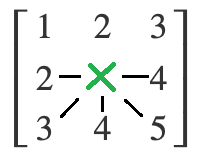
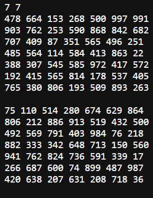
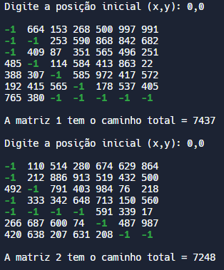

# Trabalho "O caminho guloso"

O programa lerá de um arquivo um número C de matrizes de tamanho NxN, após isso pecorrerá por cada matriz sempre através da posição com o maior número (desde que ela já não tenha sido percorrida) e então dirá a soma total do caminho em cada matriz.

## Funcionamento

O algoritmo pede ao usuário a posição inial para cada matriz e considera a posição final da matriz sempre como a posição [N,N] (a<sub>nn</sub>). Ele percorre as matrizes de forma gulosa, isto é, sempre escolhendo o maior número que esteja até 1 casa de distância e não esteja na linha acima do posição atual.

Assim, o algoritimo escolherá a posição com maior número dentre as direções: direita, esquerda, baixo, diagonal esquerda de baixo e diagonal direita de baixo, conforme imagem a seguir.



É importante ressaltar que:

- O algorítimo nunca passa pela mesma posição duas vezes;
- Quando o programa chega na ultima linha da matriz, ele anda somente para a direita. Isso permite que haja solução para todas as matrizes;
- Caso haja dois números iguais na matriz, o programa prioriza as direções na seguinte ordem: diagonal direita baixo, baixo, direita, diagonal esquerda baixo, esquerda. Isso é feito para atingir o final da matriz mais rápido.

## Entrada

O programa espera uma entrada formatada onde:

- Cada matriz está separada da próxima por uma linha em branco;
- Cada número está separado por um espaço do próximo;
- As matrizes são preenchidas somente por números positivos;
- As dimenções das matrizes é dado na primeira linha do arquivo;
- Todas as matrizes tem as mesmas dimenções.

A entrada deve estar localizada no diretório "dataset" no arquivo "input.data".

## Funções

- ```int readFile(FILE **f)```: Abre o arquivo e retorna qual a dimenção das matrizes

- ```void readMatrix(FILE *F, int size, int **matrix)```: Lê uma matriz do arquivo e preenche a variavel ```matrix``` com seus valores

- ```void printMatrix(int **matrix,int size)```: Printa a matriz na tela

- ```int **allocateMatrix(int size)```: Faz a alocação dinâmica de memória para a matriz quadrada de tamanho ```size``` e retorna seu endereço

- ```int selectDirection(int **matrix,int size,int x,int y)```: Seleciona qual será a próxima direção a ser seguida com base na posição atual ```x```,```y```, a matriz ```matrix``` e seu tamanho ```size```. Ela retorna um valor que representa a direção escolhida.

- ```int solveMatrix(int **matrix, int size)```: Move na matrix usando a função ```selectDirection``` e retorna a soma total do caminho pecorrido.

## Exemplos de compilação

A imagem a seguir é um exemplo de entrada válida para o programa. (N matrizes de kxk bla bla)



Ao ser executado, o programa mostrará o caminho pecorrido em cada matriz em verde (na maioria dos terminais) e representado pelo valor -1, e logo após colocará o resultado da soma total do caminho. Como na imagem a seguir:



No final é também colocado a soma total do caminho de todas as matrizes do arquivo.

## Compilação e Execução

Esse código possui um arquivo Makefile que realiza todo o procedimento de compilação e execução. Esse Makefile supporta as seguintes diretivas:

| Comando                |  Função                                                                                           |                     
| -----------------------| ------------------------------------------------------------------------------------------------- |
|  `make clean`          | Apaga a última compilação realizada contida na pasta build                                        |
|  `make`                | Executa a compilação do programa utilizando o gcc, e o resultado vai para a pasta build           |
|  `make run`            | Executa o programa da pasta build após a realização da compilação                                 |

A compilação do programa foi testada em sistemas linux, na distribuição arch.

# Contato

<a>
✉️ <i>getuliosantosmendes@gmail.com</i>
</a>
